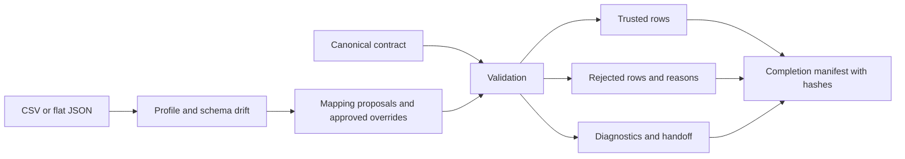

# Forward-Deployed Data Accelerator

Turn an unfamiliar customer extract into an explicit integration decision:
**what can be trusted, what must be quarantined, and what the implementation team
still needs to resolve**. The synthetic scenario includes duplicated identifiers,
a missing key, an unexpected column, an invalid status and mixed date formats.

The hard part is deciding what the source means. A plausible column-name match is
not evidence that two business concepts are equivalent. This toolkit separates
discovery, mapping approval, contract validation and publication.

## Architecture



The runtime uses only the standard library. Sources are limited to 10 MB and processed
as bounded batches. CSV headers must be unique, and ragged rows fail explicitly.
Flat JSON records are supported; nested data requires a deliberate adapter.

Mapping uses explicit source-to-target overrides, unique normalized exact matches,
then fuzzy proposals with similarity scores. **Every fuzzy, ambiguous or unmapped
target blocks trusted output until the mapping is approved in configuration.**
Similarity is a heuristic, not a calibrated probability.

Required, unique, allowed-domain, ISO date and basic email rules run on canonical
rows. Every participant in a duplicate-key group is quarantined; file order does not
decide the winner. Optional empty values remain permitted by the contract.
Unexpected source columns appear in diagnostics; missing expected columns block delivery.

## Run and test

Python 3.11–3.13:

```bash
python -m venv .venv
# Activate: Windows .venv\Scripts\Activate.ps1; POSIX source .venv/bin/activate
python -m pip install -r requirements-dev.lock.txt
python -m pip install -e . --no-deps
python -m pytest -q
python run_demo.py
```

The supplied four-record fixture produces **1 accepted and 3 rejected records**.
Each invocation creates a fresh directory under ignored `out/` containing:

| Artifact | Purpose |
| --- | --- |
| normalized.csv | Only rows passing every rule and mapping gate |
| rejected.json | Canonical rejected records, source row numbers and reasons |
| report.json | Counts, schema drift, observed types, mapping evidence and blockers |
| manifest.json | Completion marker with SHA-256 hashes of all three artifacts |

The API `fde_accel.pipeline.run(source, contract, config, output_directory)` returns
the report. It refuses to overwrite an existing output directory. Contents are
deterministic for the same input/configuration; the demo directory name is unique.
The fingerprint identifies input and configuration, not an exactly-once sink transaction.

## Failure and handoff

Malformed input or invalid configuration fails before a new output directory is created.
A filesystem failure may leave a partial directory; consumers must require the final
manifest and verify all hashes before reading trusted rows. Filesystem durability across
power loss is not guaranteed. A blocked mapping still produces a report and rejected
records, but no trusted data.

`ACCEPTED`, `REVIEW_REQUIRED` and `BLOCKED` are data decisions, not process crashes.
Do not automate a customer cutover merely because the process exits successfully.
The [runbook](docs/runbook.md), [discovery checklist](docs/discovery-checklist.md) and
[handoff example](docs/handoff.md) make acceptance, ownership and escalation explicit.

Tests cover quarantine, all duplicate participants, deterministic output, malformed CSV,
JSON input, mixed types, mapping ambiguity and overwrite protection. CI runs lint,
format checks, tests and the demo. Structured diagnostics avoid copying values into
issue messages; rejected files still contain source data and require restricted access.

## Trade-offs and extension points

- Strict mapping review trades onboarding speed for semantic safety.
- The in-memory, bounded batch design is easy to inspect; larger sources need streaming
  validation, external uniqueness indexes and partition-aware publication.
- Uniqueness is within one delivery, not across historical deliveries.
- Header matching does not solve semantic or schema-version compatibility.
- Date coercion, nested JSON and custom transforms require explicit reviewed adapters.
- A production handoff needs delivery authentication, encryption, retention/deletion,
  schema versioning, monitored schedules and a transactional/object-store commit manifest.

See [ADR: publication and trust](docs/ADR-001-trusted-output.md).
All names and records are synthetic. This independent clean-room implementation contains
no employer/client source material, proprietary configuration or confidential artifacts.
