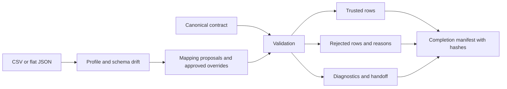

# Forward-Deployed Data Accelerator

The starting point is an unfamiliar customer extract. Four records look simple
enough to load; then the same identifier appears twice, one row has no key, and a
status value falls outside the expected domain. The source also mixes date formats
and includes a column nobody has explained yet.

This synthetic case is the working example for a small customer integration toolkit:
profile the source, propose a contract mapping, validate the result and leave a
handoff that explains which records can be trusted.

## Why I built this

Moving the bytes is rarely the decision I want to spend the most time on. I want
to know what the unfamiliar fields mean, which assumptions need a domain owner's
answer, and whether the output deserves to be called trusted. I built this to keep
those questions visible through implementation, rather than lose them once a file
loads successfully.

## Start with discovery

Before mapping "Client ID" to `customer_id`, establish the grain of a customer:
a person, an account or an organization? Decide whether the identifier is stable,
what a duplicate means, and who can resolve conflicting records. The
[discovery checklist](docs/discovery-checklist.md) captures those questions.

The profiler reports observed types and null rates. Schema drift separates missing
expected columns from unexpected additions. Missing columns block delivery;
unexpected columns remain visible for review. Flat CSV and JSON are supported.
Duplicate headers and ragged CSV rows fail explicitly; nested JSON needs an adapter.

## Decide what is safe to automate

Explicit overrides and unique normalized exact matches can populate the canonical
contract. Fuzzy matches are suggestions: **an ambiguous, fuzzy or unmapped target
blocks trusted output until its mapping is approved in configuration**. Similarity
scores help rank questions for a reviewer; they are not probabilities of correctness.

[Why ambiguous mappings require human approval](docs/ADR-002-mapping-approval.md)
records that choice, including the cost of slowing down onboarding and the limits
of exact-name matching.

The canonical rules check required fields, uniqueness, allowed domains, ISO dates
and basic email format. Optional empty values remain permitted by the contract.
For duplicate identifiers, every participant is quarantined. I do not want input
file order to choose the authoritative customer record.



## Walk through the case

Python 3.11–3.13:

```bash
python -m venv .venv
# Activate: Windows .venv\Scripts\Activate.ps1; POSIX source .venv/bin/activate
python -m pip install -r requirements-dev.lock.txt
python -m pip install -e . --no-deps
python -m pytest -q
python run_demo.py
```

The fixture produces **1 accepted and 3 rejected records**. Both rows with the
duplicated identifier are rejected, as is the row without an identifier. A row
can fail more than one rule, so issue counts need not equal rejected-row counts.

Each invocation creates a fresh directory under ignored `out/`:

| Artifact | What the next engineer needs it for |
| --- | --- |
| normalized.csv | Consume only rows that passed every rule and mapping gate |
| rejected.json | Trace rejected canonical records back to source row numbers and reasons |
| report.json | Review counts, schema drift, observed types, mapping evidence and blockers |
| manifest.json | Verify completion and the SHA-256 hashes of the three artifacts |

`fde_accel.pipeline.run(source, contract, config, output_directory)` returns the
report and refuses to overwrite an existing output directory. Artifact contents
are deterministic for the same input and configuration; the demo directory name
is unique. The fingerprint identifies the input/configuration, not an exactly-once
sink transaction.

## Make the handoff defensible

A successful process exit is not approval to cut over. `ACCEPTED`,
`REVIEW_REQUIRED` and `BLOCKED` describe data decisions. The
[synthetic handoff](docs/handoff.md) lists the unresolved questions, evidence and
proposed acceptance criteria. The [runbook](docs/runbook.md) describes replay,
approval and rollback to a previous delivery.

Malformed input or invalid configuration fails before creating a new output
directory. A write failure may leave a partial directory; consumers must require
the final manifest and verify every hash. Power-loss durability across files is
not guaranteed. A blocked mapping still yields diagnostics and rejected records,
with no trusted rows. [ADR-001](docs/ADR-001-trusted-output.md) explains the
publication boundary.

Tests exercise quarantine, duplicate groups, deterministic output, malformed input,
mapping ambiguity, configuration errors and interrupted publication. CI runs the
suite, Ruff checks and the demo. Issue messages omit raw values, but quarantine
files retain rejected records and need restricted access and a retention policy.

## Where this stops

This is an in-memory, standard-library implementation limited to 10 MB batches.
Uniqueness is checked within one delivery, not against history. Header matching
does not establish semantic or schema-version compatibility. Date coercion and
custom transforms need reviewed adapters.

A real integration also needs authenticated delivery, encryption, monitored
schedules and agreed retention/deletion. The [roadmap](FUTURE_WORK.md) focuses on
contract versions, streaming validation and object-store publication.

All examples are synthetic. This independent clean-room project contains no
employer/client code or confidential material and is not a production deployment claim.
